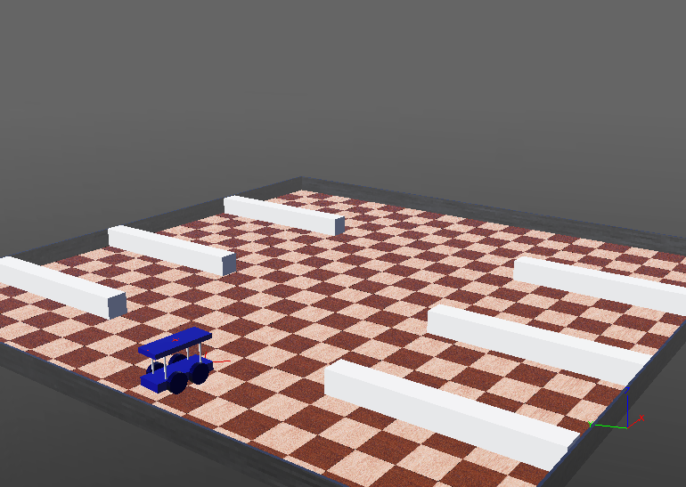
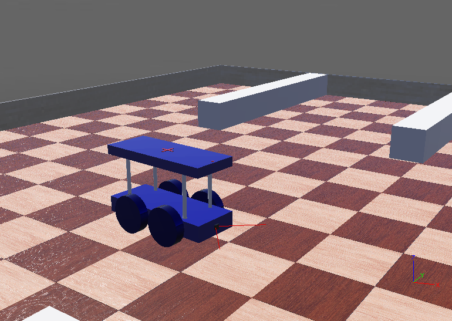
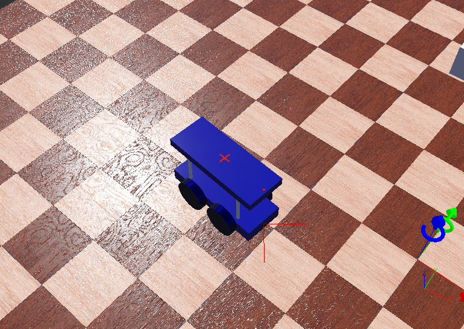
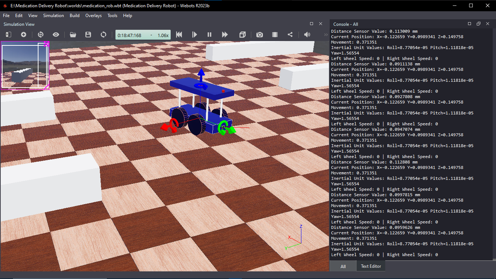
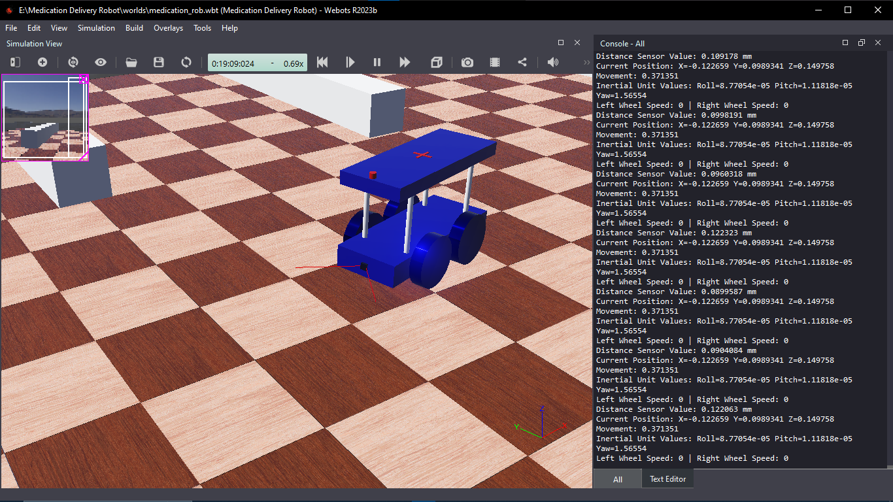
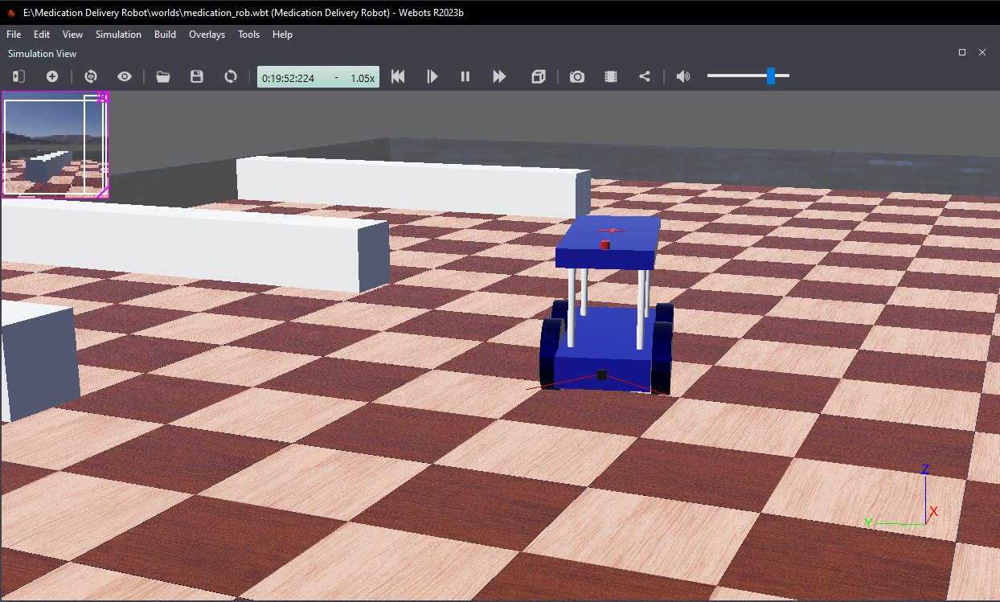
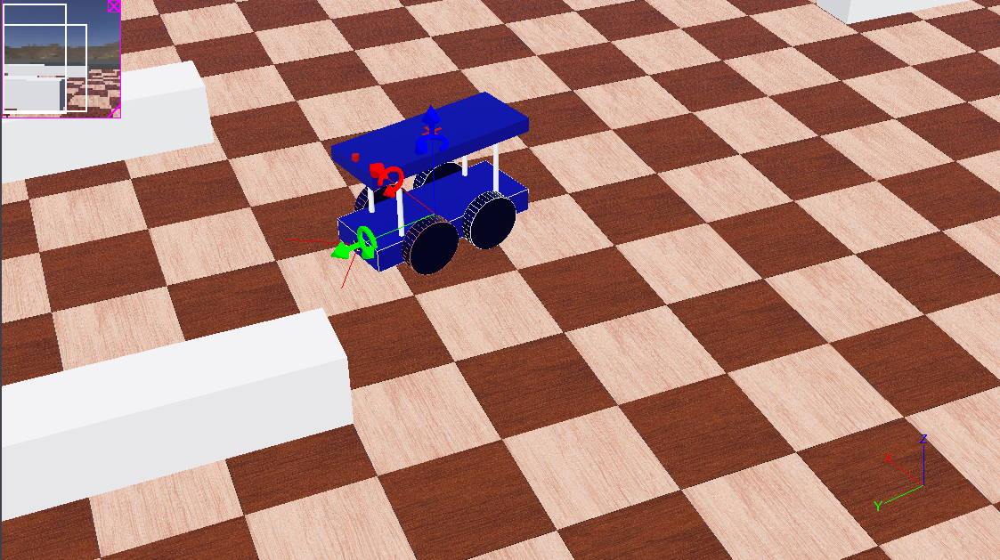

# 🤖 Medication Delivery Robot (Webots Simulation)

A Webots-based simulation of a 4-wheeled autonomous robot designed to deliver medications in healthcare environments. This robot aims to reduce medication errors and staff exposure to infectious areas by automating deliveries.

---

## 🏥 Project Objective

This robot simulates a **hospital medication delivery bot** with:
- Autonomous navigation
- Obstacle avoidance
- Manual keyboard controls
- Distance sensors, GPS, camera, and inertial unit
- Lightweight, compact, and stable design

---

## 📁 Project Structure

Medication-Delivery-Robot/
├── controllers/ # C++ control code for keyboard navigation & obstacle avoidance
├── libraries/ # Additional support libraries (if any)
├── plugins/ # Optional custom plugins
├── protos/ # Custom Webots PROTO robot parts
├── worlds/ # Contains .wbt world file
└── README.md

---

## 🛠 Technologies & Tools

- Webots Simulator
- C++
- Distance Sensor, GPS, Camera, InertialUnit
- HingeJoints + 4-wheel base
- Keyboard & Autonomous obstacle-avoidance control

---

## 🧠 Robot Features

| Feature              | Description                                                                 |
|----------------------|-----------------------------------------------------------------------------|
| Manual Control       | Arrow keys to move (forward, backward, left, right)                         |
| Obstacle Avoidance   | If obstacle detected (<0.1m), reverses and changes direction                |
| Distance Sensing     | Uses IR sensor to detect beds/walls/patients                                |
| GPS + Inertial Unit  | Tracks robot's position and orientation in real-time                        |
| Camera               | Simulates visual perception (optional face or label recognition capability) |

---

## 🚀 How to Run

1. Open Webots
2. Load the `.wbt` file from `/worlds/`
3. Make sure the correct controller (keyboard or obstacle) is set in the robot settings
4. Click "Play" to start the simulation
5. Use arrow keys or let the robot avoid obstacles on its own

---

## 📷 Screenshots

---

## 📽️ Demo Videos

- [Simulation Video](https://drive.google.com/file/d/1r86TWyyBGTcOXH7P6zHo33W7QtMYCMal/view?t=48)

---

## 🧪 Evaluation

**Strengths**
- Compact size, easy hospital navigation
- Safe movement via distance-based avoidance
- Smooth acceleration control, no jerky motion

**Limitations**
- Basic backward-only avoidance
- Not designed for slopes or high loads
- No SLAM or dynamic map-building

---

## 🔮 Future Improvements

- SLAM (Simultaneous Localization and Mapping)
- LIDAR or RGB-D sensors
- ROS 2 integration
- Medicine tray with RFID verification

---

## 👩‍💻 Author

**Hamna** – Data Scientist 
Feel free to fork, contribute, or message for collaboration!

